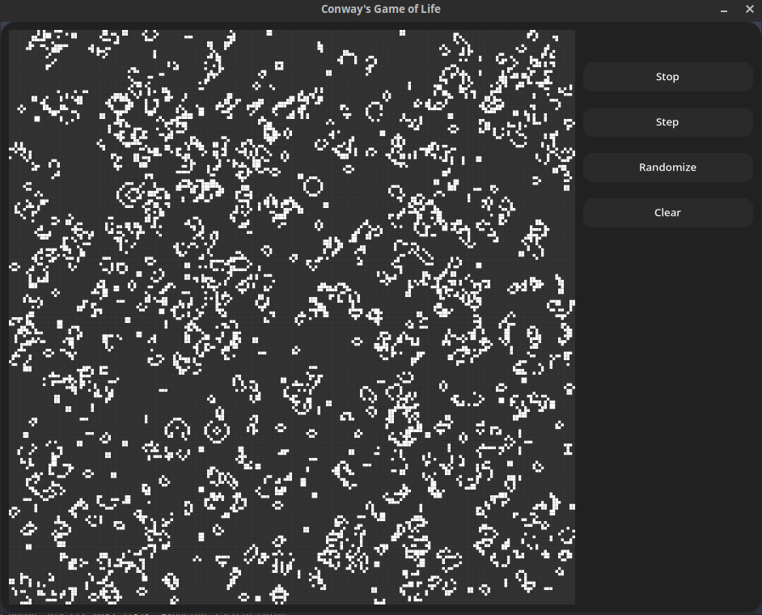

# Conway's Game of Life

An implementation of [Conway's Game of Life](https://en.wikipedia.org/wiki/Conway%27s_Game_of_Life) written
in [Rust](https://www.rust-lang.org/) with [gtk-rs](https://gtk-rs.org/).



## Build:

This program is written in [Rust](https://www.rust-lang.org/). The Rust compiler can be installed by following the
instructions on the [official download page](https://www.rust-lang.org/tools/install).

Install `gtk-rs` by following the instructions
in [the book](https://gtk-rs.org/gtk4-rs/stable/latest/book/installation.html).

```shell
# Clone the repo
$ git clone "https://github.com/edzdez/cgol-rust"
$ cd cgol-rust

# Build with cargo
$ cargo build --release
$ ./target/release/cgol

# Alternatively, to build and run in one step
$ cargo run --release
```
